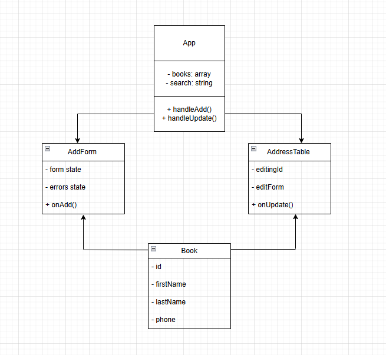

Схема компонентів Address Book
Блоки (прямокутники)

1. App.jsx
 -Тип: Container
 -Властивості: books: array, search: string
 -Методи: handleAdd(), handleUpdate()

2. AddForm.jsx
 -Тип: Presentational
 -Властивості: form state, errors state
 -Методи: onAdd()

3. AddressTable.jsx
 -Тип: Presentational
 -Властивості: editingId, editForm
 -Методи: onUpdate()

4. Book (Model)
 -Властивості: id, firstName, lastName, phone

Стрілки / взаємодія
 -App.jsx → AddForm.jsx (через проп onAdd)
 -App.jsx → AddressTable.jsx (через пропси data та onUpdate)
 -AddForm.jsx → App.jsx (виклик onAdd)
 -AddressTable.jsx → App.jsx (виклик onUpdate)
 -App.jsx створює об’єкти Book

1. Container/Presentational
 -App.jsx виступає контейнером: тримає стан контактів (books) і обробляє логіку додавання/редагування.
 -AddForm.jsx та AddressTable.jsx — презентаційні компоненти, які відображають форму і таблицю, не зберігаючи власний глобальний стан.

2. State Lifting (Піднімання стану)
 -Стан контактів (books) знаходиться в App.
 -AddForm та AddressTable отримують колбеки (onAdd, onUpdate) для взаємодії зі станом батьківського компонента.

3. Controlled Components
 -Форма додавання та інлайн-редагування в таблиці використовують керовані input-поля, значення яких зберігаються у useState.

4. Mapping / List Rendering
 -Для відображення рядків таблиці використовується метод .map(), який проходить по масиву контактів і генерує елементи <tr>.
